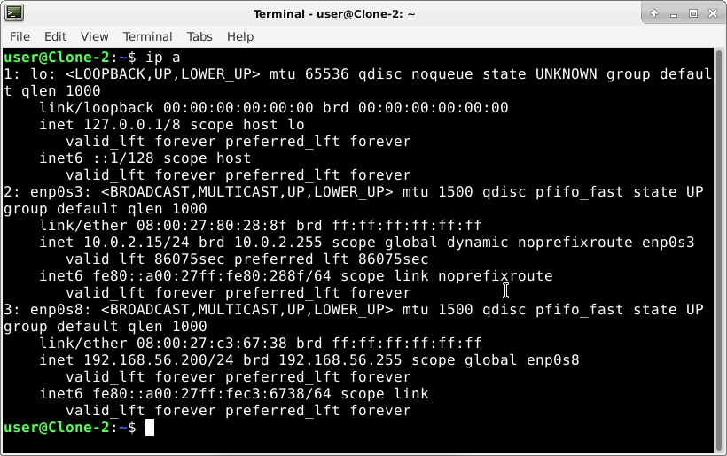
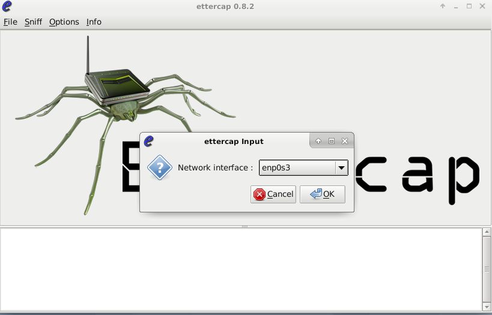
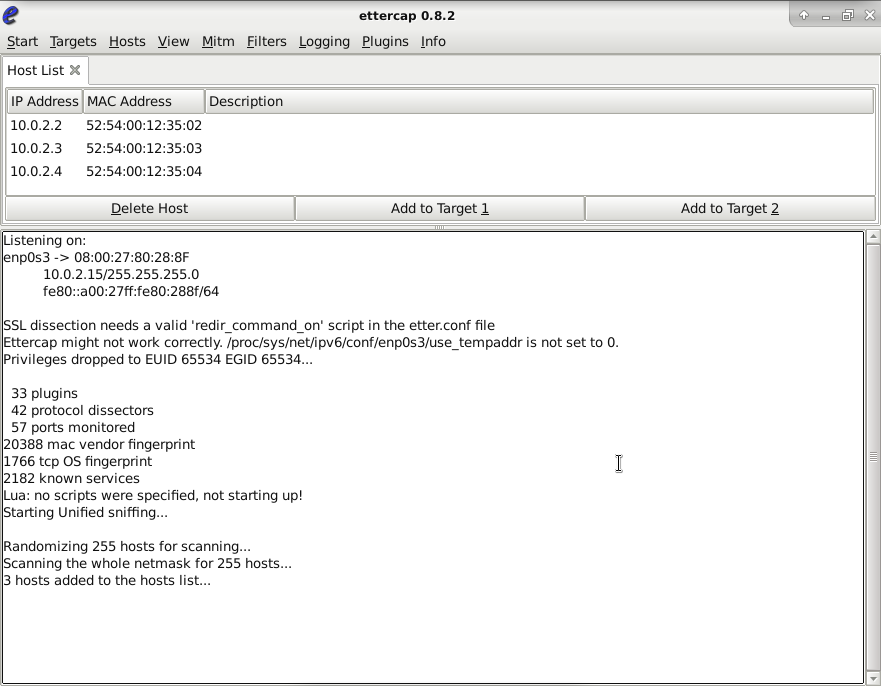
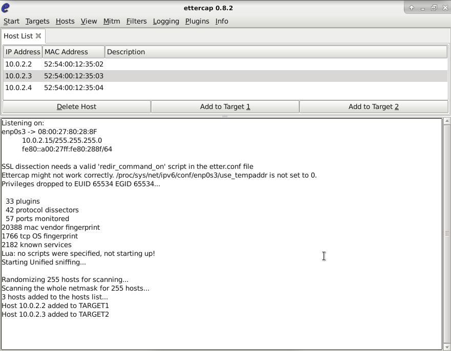
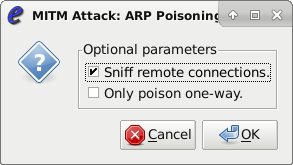
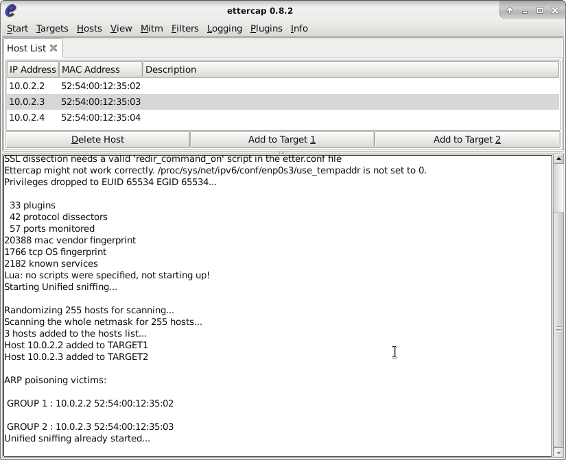
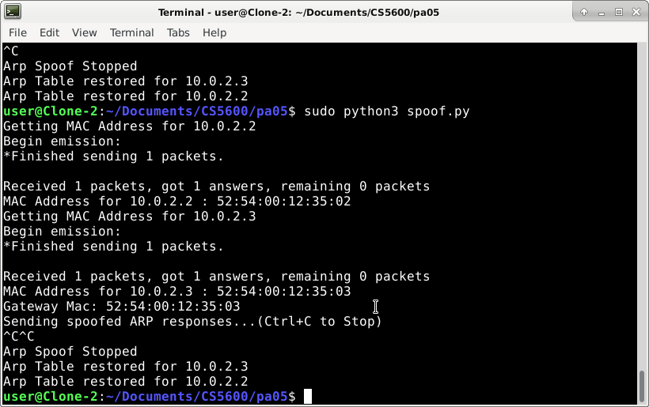
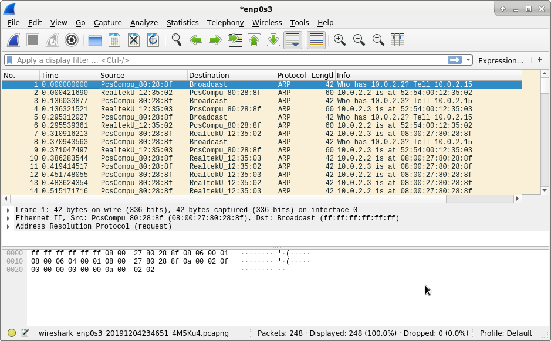

# Kali ARP Spoofing

## Step 1: Setting up a test network and testing (using ettercap)
In order to learn about how to conduct an ARP spoof, I used this website as a resource:
https://www.tutorialspoint.com/ethical_hacking/ethical_hacking_arp_poisoning.htm

First, I made sure to check my environment for my ip address to be sure I was connected to another VM as well as the internet.



I was using user@Clone-2 as my attacker, and user@Clone-1 as my victim. They are connected on enp0s3 to the internet and enp0s8 as a host-only adapter network. 
The IP for clone-2 is 192.168.56.200 and the IP for clone-1 is 192.168.56.100.

Next, I was able to add ettercap to my debian 10 environment on clone-2 by running:
```
sudo apt-get update
sudo apt-get install ettercap
```

After installing Ettercap, I ran it with sudo permissions and the -G flag to run it as a graphical interface.



The first thing I was asked was to verify the ettercap input, or which network it was running the attacks on. I specified it under enp0s3 as that is my network adapter <Br />
connected to the internet.

Next, I went to the Hosts drop down and started scanning for hosts. Three hosts on the network appeared, as shown in the image below. I then added those hosts to the 
host list to start tracking them.




After adding the hosts, I was prompted to set targets for the hosts.



Finally, using the MiTM dropdown, I was able to start an ARP Poisoning attack and specify ettercap to allow for sniffing of remote connections.



After setting up the ettercap environment, I was able to “start sniffing” on the victims, which looked like this:




## Step 2: ARP spoof penetration testing

For the next portion, I attempted to implement a method of ARP spoofing using python. For references, I used the following links:
https://www.tutorialspoint.com/python_penetration_testing/python_penetration_testing_arp_spoofing.htm <Br />
https://medium.com/datadriveninvestor/arp-cache-poisoning-using-scapy-d6711ecbe112

I was able to create a program that allowed me to poison and ARP cache by getting the IP address of a target and its gateway using Scapy.

```
sudo python3 spoof.py
```



This resulted in the spoofed ARP traffic that I was able to see inside of wireshark, which looked like this:




